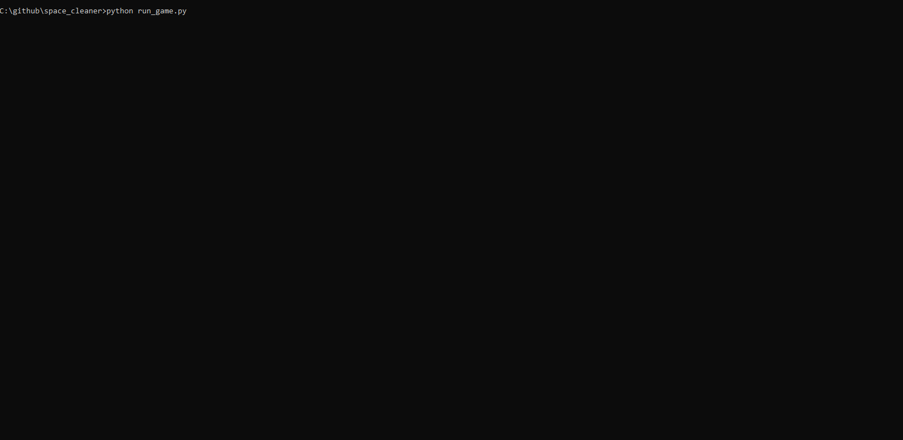

# space_cleaner
#### Simple and funny Python Game

Простая игра про то, как тяжело летать сквозь завалы. Вирусно, наглядно и 
заставляет прочувствовать всё на своей шкуре – потянет на гран-при?

Орбита Земли завалена мусором: частями ракет, обломками спутников, деталями МКС.

Задача игрока пролететь сквозь всё это. 

#### Запуск:

```bash
python run_game.py
```

 - Работает и на `python3.8 run_game.py`

#### ver 0.1.0



#### Игруха включает в себя:
 - Игровой движок на корутинах
 - Анимация (ASCII символы)
 - Управление стрелочками
 
#### Нужно добавить:
 - астероиды, мусор, спутники
 - возможность стрелять
 - описание настроек
